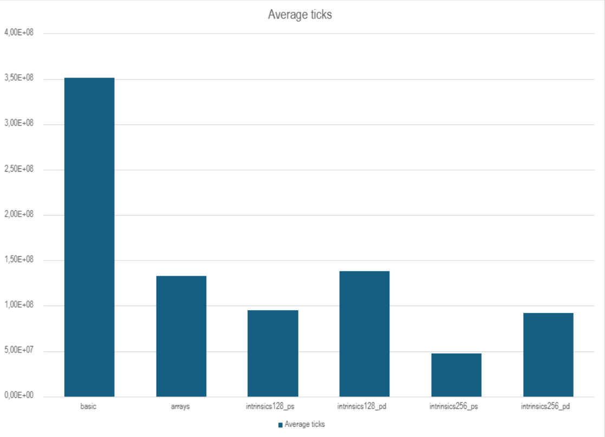
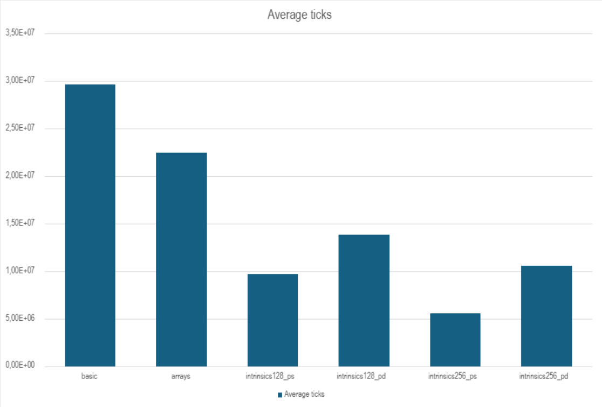

# Отчет о выполнении работы "Множество Мандельброта"

Mandelbrot set: space theme


## Цель:
Написать в трех версиях программу, которая вычисляет точки множества Мандельброта, на основе вычислений заносит цвет точки в массив пикселей и выводит на экран.

## Основные версии программы
### 1. Простейшая
В двойном цикле высчитывает последовательно каждую точку
### 2. На основе циклов и массивов
Суть этой версии в том, чтобы при компиляции с ключом -O3 компилятор оптимизировал сам код, заменив циклы и работу с массивами на работу с xmm/ymm-регистрами, что значительно увеличит скорость. По сути, мы делаем векторизацию кода
### 3. С помощью intrinsics
SIMD осуществляется за счет интринсиков - функций, соответствующие машинным инструкциям процессора.

## Краткое описание программы
В данном проекте написано 6 версий:
1. Простейшая
2. С циклами и массивами
3. xmm и single-precision
4. xmm и double-precision
5. ymm и single-precision
6. ymm и double-precision

А также эти версии, использующие многопоточность

### main
Здесь создается структура, отвечающая за передвижение картинки, и выделяется память под массив пикселей. Происходит обработка флагов, на основе которых запускается нужная версия. Основные флаги:
1. "--graphics" и "--no-graphics". Отвечают за графический режим вывода множества Мандельброта на экран и за тестирующую версию.
2. -D ("BASIC"/"ARRAYS"/"INTRINSICS"/"MASTER_TEST"). Последний вызывает основной тест, на основе которого далее будет рассчитываться ускорение.
3. -D ("__M_128"/"__M_256"). Указывает тип регистра. (только с "-D INTRINSICS")
4. "--ps"/"--pd". Указывает точность (только с "-D INTRINSICS")
5. "--cycles num_of_cycles". Вместо num_of_cycles прописывается количество циклов для тестирующей версии (только с "--no-graphics").

## Исходный код

<details>
<summary>Показать main()</summary>

```c
#include "Def_and_decl.h"
#include "WinMain.h"
#include "Testing_func.h"

int main(int argc, char* argv[]) {
    uint32_t* pixels = (uint32_t*) calloc(X_Pixels_Size * Y_Pixels_Size, sizeof(uint32_t));
    if (!pixels) {
        DEBUG_PRINTF("ERROR: pixels is nullptr\n");
        return 0;
    }

    Frame_movement movement = { .scale = 1.0, .x_offset = 0.0f, .y_offset = 0.0f, .x_0 = X_0, .y_0 = Y_0};
    int test_num_of_cycles = 0;
    int64_t config_flags = Cmd_l_parser(argc, argv, &test_num_of_cycles);

    if (config_flags == No_flag) {
        DEBUG_PRINTF("ERROR: no config_flags flag was input\n");
        return 0;
    }
    else {
        if(config_flags & MasterTest) {
            freopen("Testing_data_log.txt", "a", stdout);
            freopen("Testing_data_log.txt", "a", stderr);
            Master_test(pixels, movement);
        }
        else {
            Calc_func_t Calc_func = NULL;
            if (config_flags & Basic)
                Calc_func = Calc_func_basic;
            else if (config_flags & Arrays)
                Calc_func = Calc_func_arrays;
            else if (config_flags & Intrinsics) {
                if(config_flags & MM_128_reg) {
                    if(config_flags & Ps_type)
                        Calc_func = Calc_func_intrinsics128_ps;
                    else
                        Calc_func = Calc_func_intrinsics128_pd;
                }
                else {
                    if(config_flags & Ps_type)
                        Calc_func = Calc_func_intrinsics256_ps;
                    else
                        Calc_func = Calc_func_intrinsics256_pd;
                }
            }

            if(!Calc_func) {
                DEBUG_PRINTF("ERROR: Calc_func null ptr\n");
                return 0;
            }

            if (config_flags & Graphics)
                Graph_mode_loop(pixels, movement, Calc_func);
            else {
                Test_data test_data_void = Single_test(Calc_func_basic_void, pixels, movement,
                                    Test_num_of_cycles_void, NULL);
                Test_data test_data = Single_test(Calc_func_basic, pixels, movement,
                                    test_num_of_cycles, NULL);
                Test_accuracy(&test_data, &test_data_void, "### Calc_func_basic real data");
            }
        }
    }
    return 0;
}
```
</details>

### Многопоточность

Условная компиляция запускается через
```
make PARALLEL=yes
```

Здесь используется _Pragma("omp parallel for schedule(dynamic, 2)").
dynamic отвечает за динамическое распределение, т.е. потоки берут задачи по мере освобождения. 2 - количество итераций каждому потоку.

# Принцип измерения скорости

Основные замеры происходят в вызове Master_test. В ней для каждой версии запускается проход функции с "прологом" и "эпилогом" функции (здесь эта версия называется "void"). Это делается больше для отчетности, потому что на этот вызов тратится примерно в 10^6 раз меньше времени, чем на основную функцию, что в целом ника не влияет на средние количество тактов на вызов функции. Далее делается замер самой функции, а после вычисление всех показателей.

<details>
<summary>Пример функции версии void</summary>

```c
void Calc_func_basic_void(uint32_t* pixels, Frame_movement movement) {

    __asm__ volatile (
        "" : :
        "r"(pixels),
        "r"(movement.x_offset),
        "r"(movement.scale)
    );
    volatile real_t dx = 2.0f / (X_Pixels_Size * movement.scale);
    volatile real_t dy = 2.0f / (X_Pixels_Size * movement.scale);
    volatile real_t tem_x0 = X_0 + movement.x_offset;
    return;
}
```
</details>

<details>
<summary>Пример вызова</summary>

```c
void Master_test(uint32_t* pixels, Frame_movement movement) {

    time_t now = time(NULL);
    struct tm *curr_time = localtime(&now);
    char buffer[64];
    strftime(buffer, sizeof(buffer), "%Y-%m-%d %H:%M:%S", curr_time);
    printf("#Test session\n");
    printf("```\n");
    printf("Test start\nTime: %s\n", buffer);
    printf("Resolution: %dx%d\n", X_Pixels_Size, Y_Pixels_Size);
    printf("Center: %.3lf, %.3lf\n", X_0, Y_0);
    printf("Max_iter: %d\n", Max_iter);
    printf("```\n");

    printf("## Calc_func_basic\n");
    Test_data test_data_void = Single_test(Calc_func_basic_void, pixels, movement,
                                           Test_num_of_cycles_void, "### void");
    Test_data test_data = Single_test(Calc_func_basic, pixels, movement,
                                      Test_num_of_cycles_basic, "### full version");
    Test_accuracy(&test_data, &test_data_void, "### Calc_func_basic real data");

    ....
}
```
</details>

Замер времени происходит двумя способами: через библиотеку time.h и rdtscp. Данные замеров заносятся в структуру Test_data.

<details>
<summary>Показать функцию замера</summary>

```c
Test_data Single_test(Calc_func_t Calc_func, uint32_t* pixels, Frame_movement movement,
                      int test_num_of_cycles, const char* label) {

    Test_data test_data = {};

    test_data.frequency_start = Frequency_counter();
    test_data.timeh_t1 = clock();
    test_data.start_cycles = Rdtscp();

    for(int i = 0; i < test_num_of_cycles; i++)
        Calc_func(pixels, movement);

    test_data.end_cycles = Rdtscp();
    test_data.timeh_t2 = clock();
    test_data.frequency_end = Frequency_counter();
    Print_test_data(&test_data, test_num_of_cycles, label);

    test_data.test_num_of_cycles = test_num_of_cycles;
    return test_data;
}
```
</details>

Мы используем rdtscp, а не rdtsc чтобы избежать "out of order" выполнения программы для точного замера цикла. Инструкция cpuid нужна для этого же.

<details>
<summary>Показать функцию замера</summary>

```c
uint64_t Rdtscp() {

    uint32_t lo, hi;
    __asm__ volatile (

        "rdtscp\n\t"
        "mov %%eax, %0\n\t"
        "mov %%edx, %1\n\t"
        "cpuid\n\t"
        : "=r"(lo), "=r"(hi)
        :
        : "%rax", "%rbx", "%rcx", "%rdx"
    );
    return ((uint64_t)hi << 32) | lo;
}
```
</details>

## Что будем мерить
Мы будем мерить именно количество тактов, потому что именно это независимая от частоты величина. Мы пытались вычислить текущую частоту двумя способами, через TSP (Time stamp pointer) с частотой счетчика и реальную. Первый способ всегда выдавал 3 ГГц, потому что это ненастоящая частота, а второй выдавал сверхбольшие значения из-за того, что высчитывалась частота на всех потоках. Поэтому мы отказались от этих способов, несмотря на то, что второй можно было довести до конца. Однако как это влияло бы на многопоточность мы не знаем. Частота в экспериментальных сериях замерялась по первому методу, поэтому можно оценить приближенное значение FPS.


## Характеристики
| Устройство               	| Huawei Matebook D 16                                                	|
|:-------------------------:|:---------------------------------------------------------------------:|
| OS                       	| Windows 11 Домашняя                                                 	|
| CPU                      	| 13th Gen Intel(R) Core(TM) i9-13900H                                	|
| Объем оперативной памяти 	| 16,0 ГБ                                                             	|
| Тип системы              	| 64-разрядная операционная система, процессор x64                    	|
| Компилятор               	| x86_64-w64-mingw32-g++.exe<br>(Rev3, Built by MSYS2 project) 14.2.0 	|

## Результаты

Среднее количество тиков на 1 вызов

|                   	| Basic 	| Arrays 	| Intrinsics128_ps 	| Intrinsics128_pd 	| Intrinsics256_ps 	| Intrinsics256_pd 	|
|-----------------------|-----------|-----------|-------------------|-------------------|-------------------|-------------------|
| Parallel Disabled     | 3,51E+08  | 1,33E+08  | 9,52E+07          | 1,38E+08          | 4,77E+07          | 9,18E+07          |
| Parallel Enabled      | 2,97E+07  | 2,25E+07	| 9,70E+06       	| 1,39E+07        	| 5,58E+06      	| 1,06E+07       	|




Убрав из расчета несколько значений, в которых количество тиков значительно превосходит средние (скорее всего это связано с тем, что в этот момент параллельно протекали еще какие-то независимые процессы), мы рассчитали случайную погрешность. Погрешности измерения составляют не более процента. Данные находятся в exel таблице.

### Множитель ускорения

В процентах
|                   	| Basic    	| Arrays   	| Intrinsics128_ps 	| Intrinsics128_pd 	| Intrinsics256_ps 	| Intrinsics256_pd 	|
|-------------------	|----------	|----------	|------------------	|------------------	|------------------	|------------------	|
| Parallel Disabled 	| 0,00%    	| 163,66%  	| 268,81%          	| 154,58%          	| 635,27%          	| 282,25%          	|
| Parallel Enabled  	| 1082,81% 	| 1460,87% 	| 3518,02%         	| 2429,73%         	| 6194,55%         	| 3223,08%         	|

Или в количество раз
|                   	| Basic 	| Arrays 	| Intrinsics128_ps 	| Intrinsics128_pd 	| Intrinsics256_ps 	| Intrinsics256_pd 	|
|-------------------	|-------	|--------	|------------------	|------------------	|------------------	|------------------	|
| Parallel Disabled 	| 1,00  	| 2,64   	| 3,69             	| 2,55             	| 7,35             	| 3,82             	|
| Parallel Enabled  	| 11,83 	| 15,61  	| 36,18            	| 25,30            	| 62,95            	| 33,23            	|

А также относительный прирост скорости из-за многопоточности

|              	| Basic    	| Arrays  	| Intrinsics128_ps 	| Intrinsics128_pd 	| Intrinsics256_ps 	| Intrinsics256_pd 	|
|--------------	|----------	|---------	|------------------	|------------------	|------------------	|------------------	|
| Проценты     	| 1082,81% 	| 492,00% 	| 881,00%          	| 893,69%          	| 756,09%          	| 769,35%          	|
| В кол-во раз 	| 11,83    	| 5,92    	| 9,81             	| 9,94             	| 8,56             	| 8,69             	|


Стоит уточнить, что реализация Basic и Arrays выполнялась на float, поэтому скорость намного больше, чем если бы выполнялась на double. А также, что все версии компилировались с флагом -O3 (подробнее можно увидеть в makefile).


# Выводы
В данной работе были написано 6 различных версий рассчета множества Мандельброта. Была исследована зависимость ускорения программы от типа оптимизации. На основе этого сделаны сравнительные таблицы и гистограммы.
